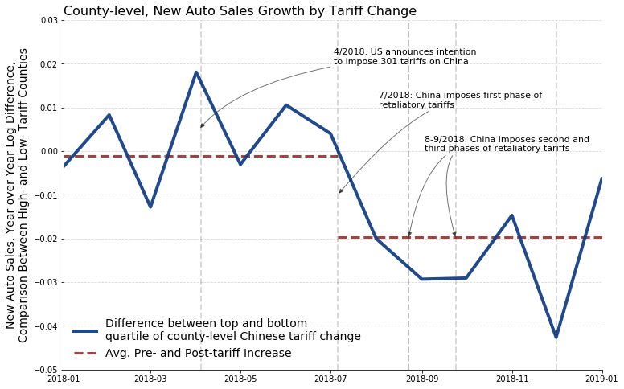

### "[The Consumption Response to Trade Shocks: Evidence from the US-China Trade War](http://www.waugheconomics.com/uploads/2/2/5/6/22563786/waugh_consumption.pdf)"

This repository contains code to reproduce aspects of the paper ["The Consumption Response to Trade Shocks: Evidence from the US-China Trade War."](http://www.waugheconomics.com/uploads/2/2/5/6/22563786/waugh_consumption.pdf) Only results associated with non-proprietary data are available, i.e. Chinese retaliatory tariffs and it's projection to the county level and then their correlation with trade and employment. The auto analysis notebook is **not** included here as the data used is proprietary.

There are several files associated with this repository. Almost all of the notebooks directly pull data from the original source (trade data using the [Census International Trade API](https://www.census.gov/data/developers/data-sets/international-trade.html), concordance from the US Census, employment data from the [BLS](https://www.bls.gov/cew/downloadable-data-files.htm), [shapefiles from the US Census](https://www.census.gov/geographies/mapping-files/time-series/geo/tiger-line-file.2017.html)). After running the files, most of the output is saved as a  ``.parquet`` files and stored in the data folder.

Below is a description of each jupyter notebook in the repository. If you don't know what a "jupyter notebook" is or what to do with them, this website is a great place to start: [https://datascience.quantecon.org/](https://datascience.quantecon.org/).

The files below are organized in the sequence for which they must be run if you do not have the intermediate files.

- [``updated_tariff_data.ipynb``](https://github.com/mwaugh0328/consumption_and_tradewar/blob/master/updated_tariff_data.ipynb) which uses and shapes the tariff data from [Bown, Jung, and Zhang](https://www.piie.com/blogs/trade-and-investment-policy-watch/trump-has-gotten-china-lower-its-tariffs-just-toward). I'm hosting their datafile as I had problems with a direct link.

- [``alt_hs_naics_mapping.ipynb``](https://github.com/mwaugh0328/consumption_and_tradewar/blob/master/alt_hs_naics_mapping.ipynb) starts from the Census concordance which provides a mapping from hs10 to naics codes and then creates a mapping from hs6 to naics. In the ``data`` folder there is ``alt_concordance.parquet`` which you can download and directly run to proceed to the next step below.

- [``countylevel_tariffs_and_exports.ipynb``](https://github.com/mwaugh0328/consumption_and_tradewar/blob/master/countylevel_tariffs_and_exports.ipynb) takes the tariff data above and then projects down to the county level, in addition to merging it with US export data and US employment data (just for the year 2017). The projection method simply takes a employment weighted averages of tariffs at the NAICS 3 digit level. Waugh (2019) explains more in detail, in addition to the text in the notebook.

- [``tariff_map.ipynb``](https://github.com/mwaugh0328/consumption_and_tradewar/blob/master/tariff_map.ipynb) using the tariff data above, it creates a map of tariff exposure. It downloads the required shapefiles and then plots the change in a county's tariff at the county level. It assumes that you have a folder below the repository called ``shapefiles`` and then ``county`` and ``state`` for which the code will download and unzip the shapefiles into that folder.

- [``bls_quarterly_county.ipynb``](https://github.com/mwaugh0328/consumption_and_tradewar/blob/master/bls_quarterly_county.ipynb) grabs the [Quarterly Census of Employment and Wages](https://www.bls.gov/cew/) files from the BLS and then creates employment measures at the county-level, monthly frequency. It is then merged with the trade data from above. **Note** there is a place where, depending on if commented, creates a dataset with goods producing employment or total private employment.

- [``employment_analysis.ipynb``](https://github.com/mwaugh0328/consumption_and_tradewar/blob/master/employment_analysis.ipynb) performs the employment analysis in Section 5 and has the unweighted regression results as well. The analysis also mimics most aspects of the auto analysis in the paper (e.g., visualizations, tabular analysis, regression results).

- [``trade_analysis.ipynb``](https://github.com/mwaugh0328/consumption_and_tradewar/blob/master/trade_analysis.ipynb) performs the trade analysis in Section 5 (us exports to china, exports in total) and it contains the unweighted regression results as well.

As of the last push, these notebooks will come very close, but not exactly replicate the values in the [NBER working paper](https://www.nber.org/papers/w26353) version due to my changing of code regarding how the concordance is treated. To reproduce the NBER version results, read the notes around code cell 15 in [``countylevel_tariffs_and_exports.ipynb``](https://github.com/mwaugh0328/consumption_and_tradewar/blob/master/countylevel_tariffs_and_exports.ipynb) and uncomment the appropriate parts.

Finally, I must highlight that there is a [license](https://github.com/mwaugh0328/consumption_and_tradewar/blob/master/LICENSE) regarding this work, it's use, and so forth.
